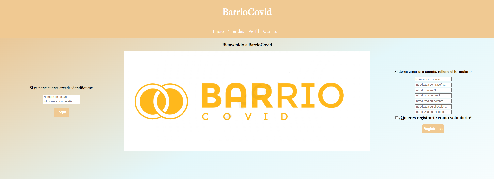
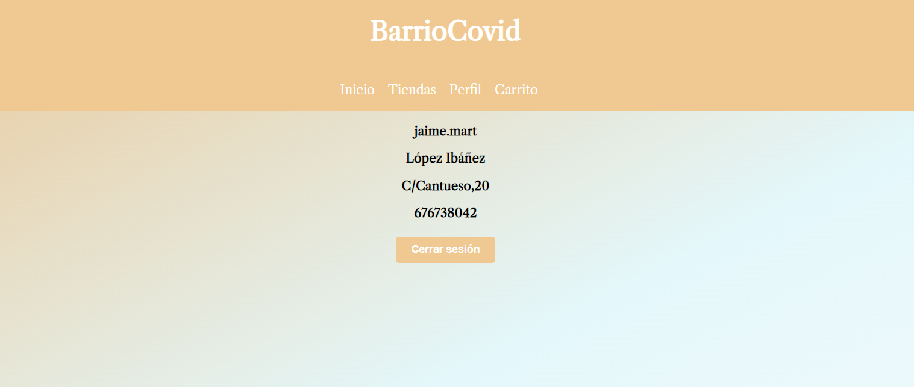
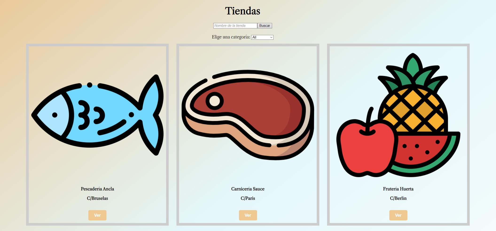
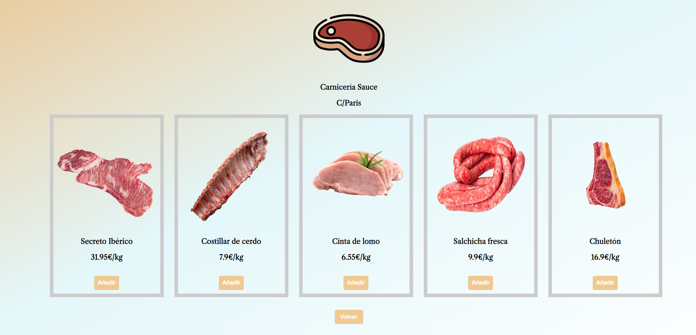
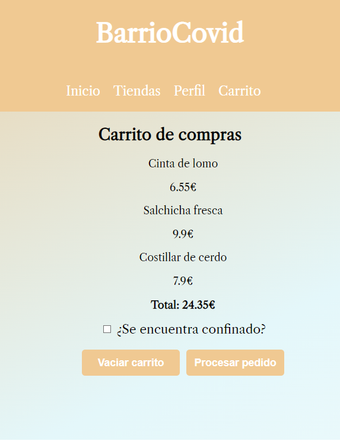

# BarrioCovid

Aplicación web que ofrece un servicio de e-shopping. 

Con este proyecto buscamos sustituir las aplicaciones convencionales de mensajería por una aplicación destinada 
a mostrar los productos en venta ofrecidos por distintos comercios y posibilitar la compra de los vecinos de la zona. 
Los vendedores que se encuentren registrados podrán mostrar sus productos y aceptar los pedidos de los clientes. 
Por otra parte, los compradores podrán realizar pedidos para recoger en el propio establecimiento. 
Además, se implementará una función por la cual los vecinos vulnerables que realicen pedidos serán emparejados con 
otros vecinos cercanos o voluntarios que recogerán su compra y se la llevaran a su domicilio.

## Despliegue aplicación
La forma más sencilla de llevar a cabo el despliegue de la aplicación es de la siguiente manera: 
```
git clone https://github.com/jaimemartinez-99/BarrioCovid
cd BarrioCovid
cd frontend
npm install
npm i react-toastify
npm start
```
Tras esto, podrá utilizar la aplicación en la direccion: **localhost:3000**
## Frontend
El trabajo de frontend se ha realizado usando React, un conocido framework de JavaScript.

## Backend
El trabajo de backend se ha realizado usando Springboot como servidor y MySQL para almacenar la información.

## Imágenes de la aplicación
A continuación se muestran unas imágenes de las diferentes vistas de la aplicación:

**Vista inicio sesión/registro**


**Vista perfil**


**Vista tiendas**


**Vista de una tienda**


**Vista carrito de la compra**



